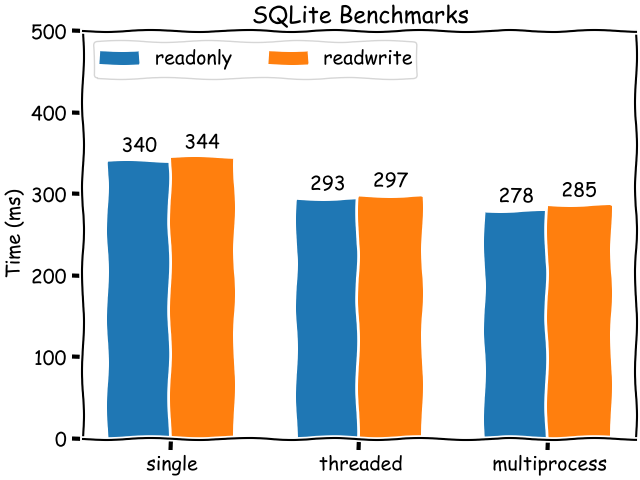

## About

This is a series of tools that create a fake sqlite3 database and measure its
performance both in a single thread, with async, and with threading.

## Sources

* create_sample.py -- crates sample database
* bench.py -- runs benchmark
* results.py -- uses matplotlib to plot results, hardcoded
* worker.py -- used by bench.py

## Results

Results so far:

## Notes

What we are seeing is that with modest amounts of concurrency you get a small amount
of performance increase over a single task.

Multiprocessing helps slightly more than threads.

Multiprocessing saturates out with more processes.

This largely demonstrates the fact that disk i/o doesn't parallelize very well.

